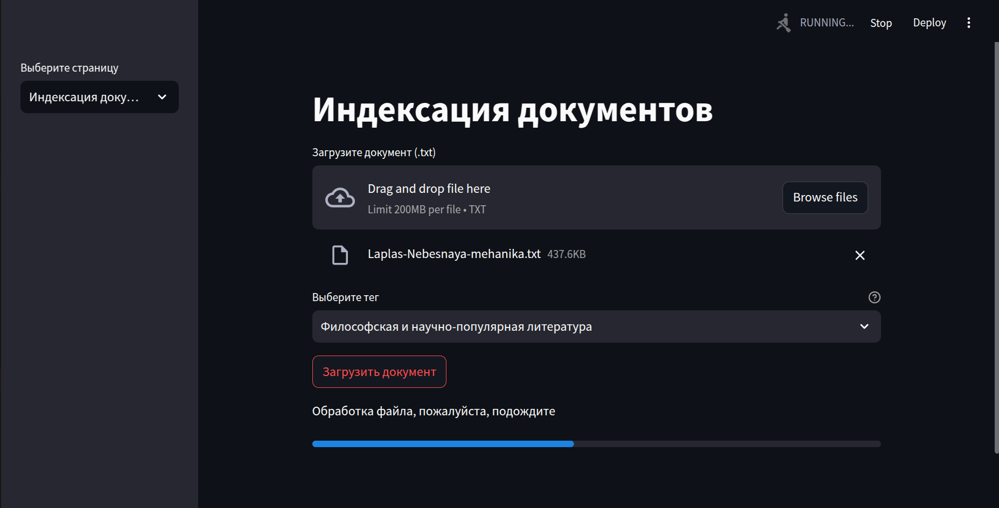

# RAG Бобёр
## Реализация Кейса №3 "Сервис поиска параграфов"


# Подробно о проекте
## Содержание
1. [Введение](#введение)
2. [Краткая теория о RAG-системах](#краткая-теория-о-rag-системах)
3. [Описание структуры проекта](#описание-структуры-проекта)
4. [Процесс установки](#процесс-установки)
    - [Шаг 1. Установка Docker](#шаг-1-установка-docker)
    - [Шаг 2. Создание и запуск контейнера](#шаг-2-создание-и-запуск-контейнера)
5. [Использование программы](#использование-программы)
    - [Интерфейс веб-приложения](#интерфейс-веб-приложения)
    - [Страница индексации](#страница-индексации)
    - [Страница поиска](#страница-поиска)


---

## Введение
**RAG Бобёр** – это реализация кейса №3 "Сервис поиска параграфов". Наш проект представляет собой веб-сервис для индексации и поиска текста по параграфам с возможностью фильтрации по ключевым словам и другим параметрам.

Сервис реализован с использованием **FastAPI** для создания API и **Docker** для упаковки приложения.

---

## Краткая теория о RAG-системах
**RAG (Retrieval-Augmented Generation)** – это архитектура, объединяющая поиск информации и генерацию текста. В традиционной RAG-системе поиск информации происходит из заранее индексированного набора данных, а затем модель генерирует ответ, используя найденные фрагменты.

В данном проекте реализован упрощённый вариант RAG-системы, где ключевым процессом является **поиск параграфов** по их содержимому и ключевым словам. Это позволяет быстро находить релевантные части текста по пользовательскому запросу.

---

## Описание структуры проекта
Проект состоит из следующих ключевых компонентов:

RAG-BOBER/<br>
│<br>
├── backend/<br>
│   ├── app/<br>
│   │   ├── database/<br>
│   │   │   ├── __init__.py<br>
│   │   │   └── database.py<br>
│   │   │<br>
│   │   ├── embending/<br>
│   │   │   ├── __init__.py<br>
│   │   │   └── embending.py<br>
│   │   │<br>
│   │   ├── models/<br>
│   │   │   ├── __init__.py<br>
│   │   │   └── models.py<br>
│   │   │<br>
│   │   └── routers/<br>
│   │       ├── __init__.py<br>
│   │       ├── endpoints.py<br>
│   │       └── main.py<br>
│   │<br>
│   ├── Dockerfile<br>
│   └── requirements.txt<br>
│<br>
├── frontend/<br>
│   ├── Dockerfile<br>
│   ├── main.py<br>
│   └── requirements.txt<br>
│<br>
├── .gitignore<br>
└── docker-compose.yml<br>


---

## Процесс установки
### Шаг 1. Установка Docker
Перед началом работы необходимо установить **Docker**:

**1. Обновите пакеты системы:**
```bash
sudo apt update && sudo apt upgrade -y
```

**2. Установите Docker и Docker Compose:**
```bash
sudo apt install -y docker.io docker-compose
```

**3. Проверьте установку Docker:**
```bash
docker --version
docker-compose --version
```

**4. Запустите сервис Docker:   **
```bash
sudo systemctl start docker
sudo systemctl enable docker
```

### Шаг 2. Создание и запуск контейнера
1. **Склонируйте репозиторий проекта:**
```bash
git clone https://github.com/Riddars/RAG-BOBER.git
cd RAG-BOBER
```

2. **Соберите Docker-образ:**
```bash
docker-compose build
```

3. **Запустите docker-compose:**
```bash
docker-compose up
```

После запуска веб-интерфейс будет доступен по адресу `http://localhost:8501`.

# Документация
http://localhost:8000/docs

---

## Использование программы
### Интерфейс веб-приложения
Перейдите по ссылке `http://localhost:8501` в браузере. При первом запуске будет происходить загрузка необходимых моделей и зависимостей, что может занять некоторое время. **Пожалуйста, не закрывайте окно и отключите VPN на время загрузки.**

### Страница индексации
- **Назначение:** загрузка текстовых данных и их подготовка для последующего поиска.
- **Инструкция по использованию:**
    1. Загрузите файл с текстом (максимальный размер: **200 МБ**).
    2. Выберите один из доступных тегов для текста.
    3. Нажмите кнопку **"Отправить на обработку"**.
    4. Дождитесь сообщения об успешной загрузке и индексации файла.

> **Рекомендация:** не закрывайте окно до появления сообщения о завершении загрузки.
<br>

<br>

### Страница поиска
- **Назначение:** поиск по загруженному и проиндексированному тексту.
- **Инструкция по использованию:**
    1. Введите текстовый запрос в поле поиска.
    2. Выберите теги для фильтрации результатов (опционально).
    3. Укажите количество результатов (от **1 до 100**).
    4. Нажмите кнопку **"Поиск"**.
    5. Ознакомьтесь с результатами поиска на странице.

<br>

<br>


## Запросы к серверу напрямую
### 1. Эндпоинт для индексирования (http://localhost:8000/indexing)
Чтобы добавить новые документы в базу данных, отправьте POST-запрос на эндпоинт /indexing с телом запроса в формате JSON.
## Пример запроса:
```JSON
[
  {
    "content": "Это текст первого документа.",
    "dataframe": "Техническая литература",
    "keywords": ["технологии", "инновации", "наука"]
  },
  {
    "content": "Это текст второго документа.",
    "dataframe": "Философская литература",
    "keywords": ["мудрость", "жизнь", "философия"]
  }
]
```
### 2. Эндпоинт для поиска (http://localhost:8000/searching)
Для выполнения поиска по проиндексированным данным отправьте POST-запрос на эндпоинт /searching с телом запроса в формате JSON.
## Пример запроса:
```JSON
{
  "text": "Что такое технологии?",
  "filter_by": ["Техническая литература"],
  "top_k": 3,
  "keywords": ["технологии", "инновации"]
}
```
### Пояснения к параметрам:
#### Для индексирования:
- content: Текст документа, который нужно добавить в базу данных.<br>
- dataframe: Категория документа.<br>
- keywords: Ключевые слова, описывающие содержание документа.<br>
#### Для поиска:
- text: Текст поискового запроса.<br>
- filter_by: Список категорий для фильтрации результатов.<br>
- top_k: Количество топовых результатов, которые необходимо вернуть.<br>
- keywords: Ключевые слова, уточняющие контекст поиска.<br>


Используйте эти эндпоинты для взаимодействия с приложением напрямую!


## Структура базы данных

База данных содержит коллекцию Data_base_paragraphs, настроенную для работы с текстовыми данными и их векторными представлениями. Основные параметры и структура базы данных описаны ниже.

### Коллекция: Data_base_paragraphs

- Описание: Коллекция предназначена для хранения текстовых данных, анализа контента и выполнения поиска по текстовым и векторным запросам.
- Используемый векторизатор: text2vec-huggingface  
  - Модель: sentence-transformers/all-MiniLM-L6-v2  
  - Метрика расстояния: Косинусное расстояние  

#### Свойства:

| Имя          | Тип данных      | Описание                               | Индексация |
|--------------|-----------------|----------------------------------------|------------|
| content    | text          | Основное текстовое содержимое          | Да         |
| dataframe  | text          | Дополнительные данные в текстовом виде | Да         |
| keywords   | text[]        | Ключевые слова для поиска              | Да         |

#### Конфигурация индекса:
- BM25:
  - b: 0.75
  - k1: 1.2  
- Интервал очистки: 60 секунд  
- Стратегия шардирования: hash (1 физический шард, 128 виртуальных)  

#### Конфигурация векторного индекса:
- Метрика расстояния: Косинусное расстояние  
- Эф (EF):
  - Минимум: 100
  - Максимум: 500
  - Конструкция: 128
- Максимум соединений: 32  

Коллекция оптимизирована для гибридного поиска: текстового поиска с использованием BM25 и векторного поиска с применением моделей трансформеров. 

### Пример использования
Данные в коллекции могут быть использованы для:
- Векторного поиска по схожести текстов.
- Поиска по ключевым словам и текстовым запросам.
- Генерации контента на основе заданных текстовых данных.

---
**Команда** RAG Бобёр
